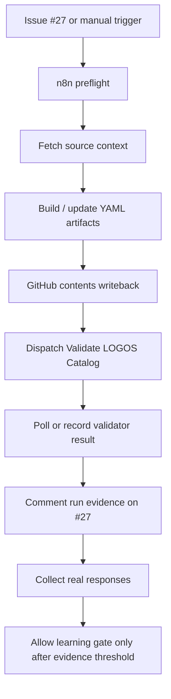

# PILOT-0001 n8n Implementation Plan

Status: draft for implementation

Owner: Codex / implementation agent

Related:

```text
roadmap/FOUNDATION-I-REFERENCE-INTEGRITY.md
automation/n8n-runtime.md
automation/n8n/pilot-0001/NODES.md
automation/n8n/pilot-0001/GITHUB-WRITEBACK.md
pilots/PILOT-0001/
#27 PILOT-0001: Raw meaning end-to-end system run
```

---

## Executive Intent

PILOT-0001 should now move from repository-proven artifacts into n8n execution.

The goal is not to make n8n the source of truth.

The goal is to make n8n reliably execute the LOGOS chain and write evidence back into GitHub, where the repository validator can judge whether the run is trustworthy.

Core rule:

```text
GitHub remains memory and truth.
n8n becomes execution and orchestration.
The validator remains the gate.
```

---

## Current State

Foundation I is implemented enough to prevent fake-successful runs:

```text
direct validator execution works
object ID registry exists
duplicate IDs are detected
declared broken references are detected
PILOT-0001 artifacts validate
learning/law review is blocked until enough real responses exist
```

PILOT-0001 already has local/repository artifacts:

```text
raw-meaning.yaml
meaning-edges.yaml
human-truth.yaml
human-contradiction.yaml
belief-shift.yaml
meaning-atoms.yaml
story-pattern.yaml
script-draft.md
experiment-plan.yaml
response collection packet
status readiness tool
```

n8n currently has workflow/design coverage, but the next stage is to make the runtime operate safely and observably.

---

## Non-Negotiable Guardrails

```text
Do not reboot the VPS.
Do not restart Docker, n8n, nginx, Postgres or other live services during active testing.
Do not store secrets in git.
Do not make n8n the source of truth.
Do not generate learning or law-review from simulated data.
Do not create content without traceability to LOGOS objects.
Do not let Markdown replace validator-facing YAML objects.
Do not rewrite raw meaning after intake.
```

Secrets must stay in local ignored files, environment variables or n8n credentials.

---

## Target Runtime Shape



The runtime should be boring, explicit and inspectable.

---

## Implementation Sequence

### Phase 0 - Safety And Inventory

Purpose:

```text
Confirm what is already running in n8n and what credentials are available without touching live services.
```

Input:

```text
n8n API access
existing workflow IDs
GitHub repository state
issue #27
```

Output:

```text
inventory note
confirmed workflow IDs
credential capability checklist
no service restart
```

Acceptance criteria:

```text
All n8n workflow IDs are known.
All required credentials are confirmed by safe API calls.
No VPS or service restart happens.
```

Manual test:

```text
Call n8n API read-only endpoints.
Confirm workflow list and current active flags.
```

Evidence:

```text
automation/n8n/pilot-0001/writeback/ inventory report
comment on #27
```

Future automation path:

```text
Add a preflight node that emits credential and workflow readiness without writing files.
```

---

### Phase 1 - Runtime Contract

Purpose:

```text
Freeze the exact n8n contract before enabling writes.
```

Input:

```text
NODES.md
GITHUB-WRITEBACK.md
PILOT-0001 artifact paths
validator rules
```

Output:

```text
one runtime contract document or updated NODES.md
node-by-node input/output schema
writeback order
failure behavior
```

Acceptance criteria:

```text
Every write node has a target path, commit message and rollback-safe behavior.
Every generation node has validator-facing output requirements.
Learning/law nodes are explicitly gated.
```

Manual test:

```text
Review workflow against the contract before activation.
```

Evidence:

```text
updated automation/n8n/pilot-0001 docs
issue #27 contract comment
```

Future automation path:

```text
Generate n8n node config from the contract instead of manually copying paths.
```

---

### Phase 2 - GitHub Writeback Primitive

Purpose:

```text
Build one safe reusable writeback mechanism for GitHub contents API.
```

Input:

```text
repo_full_name
branch
target path
file content
commit message
GitHub token credential
```

Output:

```text
created or updated file
commit sha
writeback status object
```

Acceptance criteria:

```text
GET existing file works.
Create missing file works in a test path.
Update existing file works only with sha.
Commit sha is captured.
Failure returns a structured error.
```

Manual test:

```text
Use a disposable test path first, then remove it through a normal commit.
```

Evidence:

```text
writeback report
commit sha
issue #27 comment
```

Future automation path:

```text
Promote writeback primitive into a reusable n8n sub-workflow for all LOGOS workflows.
```

---

### Phase 3 - Raw Meaning Runtime

Purpose:

```text
Automate the safest first chain step: preserve raw meaning from issue #27.
```

Input:

```text
issue #27 body
raw meaning extraction markers
author intent
AX-021
```

Output:

```text
pilots/PILOT-0001/input/raw-meaning.yaml
run evidence
```

Acceptance criteria:

```text
Raw text is copied, not rewritten.
source_issue and source_issue_url are present.
raw-meaning.yaml validates.
writeback commit sha is recorded.
```

Manual test:

```text
Compare raw_text against the issue source before trusting the write.
```

Evidence:

```text
GitHub commit
validator pass
issue #27 comment
```

Future automation path:

```text
Allow Telegram/form/manual webhook intake after the GitHub issue intake is proven.
```

---

### Phase 4 - Meaning Chain Generation

Purpose:

```text
Generate validator-facing LOGOS YAML objects through n8n while preserving traceability.
```

Input:

```text
raw-meaning.yaml
PROMPTS.md
object schemas
reference integrity rules
```

Output:

```text
meaning-edges.yaml
human-truth.yaml
human-contradiction.yaml
belief-shift.yaml
meaning-atoms.yaml
story-pattern.yaml
```

Acceptance criteria:

```text
Every object has id, type, status and pilot_id.
Every derived object references its source object.
story-pattern.yaml is the validator-facing artifact.
story-pattern.md is optional only.
Validator passes after writeback.
```

Manual test:

```text
Inspect object IDs and source references before enabling downstream draft generation.
```

Evidence:

```text
commit shas
validator result
run manifest update
#27 comment
```

Future automation path:

```text
Move from one pilot-specific chain to a reusable object-generation workflow.
```

---

### Phase 5 - Runtime Draft And Experiment Plan

Purpose:

```text
Generate runtime expression only after the LOGOS object chain is valid.
```

Input:

```text
belief-shift.yaml
meaning-atoms.yaml
story-pattern.yaml
safety constraints
```

Output:

```text
script-draft.md
experiment-plan.yaml
review packet
```

Acceptance criteria:

```text
Draft references source LOGOS objects.
Experiment plan references source script and meaning objects.
No unsupported learning claims are created.
Validator passes.
```

Manual test:

```text
Review script draft for traceability and safety before respondent collection.
```

Evidence:

```text
commit shas
review note
validator result
#27 comment
```

Future automation path:

```text
Add domain-specific claim checker as a separate node, not as hidden prompt behavior.
```

---

### Phase 6 - Validator Dispatch And Status Loop

Purpose:

```text
Make every n8n write prove itself through the repository validator.
```

Input:

```text
latest commit sha
validate-catalog.yml workflow dispatch
local status readiness logic
```

Output:

```text
validator dispatched or completed
workflow run URL
pass/fail status
next action
```

Current implementation note:

```text
An inactive dedicated validator dispatch workflow now exists:
LOGOS PILOT-0001 Validator Dispatch Gate
id: oWQbN9u1VI4AS6rq
controlled dispatch test: passed
GitHub Action run: 28595297447
status lookup test: passed
polling mode: single_lookup_after_45s
polling test run: 28595880528
bounded polling test: passed
bounded polling mode: bounded_3_attempts_15s_interval
bounded polling test run: 28609662029
```

Acceptance criteria:

```text
n8n can dispatch the GitHub Action.
Current gate performs a single status lookup after dispatch.
If the run completes within the lookup window, n8n records final status.
If the run is still active, n8n records validator_status: in_progress and downstream execution remains blocked.
Failure stops downstream execution.
```

Manual test:

```text
Trigger validation from n8n and verify the run in GitHub Actions.
```

Evidence:

```text
workflow run URL
issue #27 comment
run manifest update
```

Future automation path:

```text
Add a generic validation gate reusable across all LOGOS workflows.
```

Current issue-comment implementation note:

```text
An inactive dedicated issue comment workflow now exists:
LOGOS PILOT-0001 Issue Comment Gate
id: UwkfEOmygkX4BBe5
controlled comment test: passed
comment URL: https://github.com/deflagyn/LOGOS-Engine/issues/27#issuecomment-4869044282
```

---

### Phase 7 - Response Collection Gate

Purpose:

```text
Keep learning and law review blocked until real respondent evidence exists.
```

Input:

```text
RESPONDENT-HANDOUT.md
COLLECTOR-GUIDE.md
response intake schema
scripts/create_pilot_response.py
scripts/pilot_0001_status.py
```

Output:

```text
sanitized response files
status report
learning_allowed false/true
```

Acceptance criteria:

```text
Simulated responses are rejected.
Responses with personal data not removed are rejected.
Learning remains blocked until minimum real response threshold is met.
```

Manual test:

```text
Run status tool before and after response intake.
```

Evidence:

```text
response files
status report
validator pass
#27 comment
```

Future automation path:

```text
Add Google Sheets or form intake only after the local response intake contract remains stable.
```

---

## Advantages

```text
The runtime becomes observable instead of magical.
The repository remains the final memory.
Validator failures become early warnings, not late surprises.
n8n can move fast without becoming conceptually authoritative.
Every generated artifact has a source and a testable chain.
```

---

## Tradeoffs

### More ceremony

The workflow will feel slower than a direct AI generation chain.

That cost is intentional. The project is building a meaning engine, not a content shortcut.

### More GitHub writes

The run may create several commits.

This is useful for auditability, but later the system may need commit batching.

### More failure points

n8n, GitHub API, model calls and validation can each fail.

This is acceptable if each failure is structured and stops downstream trust.

### Pilot-specific wiring

The first implementation may be too PILOT-0001-specific.

That is acceptable for the first runtime, but reusable primitives should be extracted after the run is proven.

---

## What Is Between The Lines

The hidden risk is not that n8n fails.

The hidden risk is that n8n succeeds too easily.

If the workflow writes impressive files without traceability, LOGOS quietly becomes a content generator. That would violate the project identity.

This stage should therefore optimize for friction in the right places:

```text
preserve raw meaning
validate references
record evidence
block unsupported learning
make every runtime claim inspectable
```

The uncomfortable truth:

```text
The first n8n runtime should be less clever than it could be.
It should be more auditable than convenient.
```

---

## How To Improve This 10x

### 1. Contract-first workflow generation

Define the workflow in repository YAML, then generate or verify n8n nodes from that contract.

This prevents manual drift between docs and n8n.

### 2. Reusable writeback sub-workflow

Turn GitHub create/update/comment/dispatch into a reusable n8n primitive.

This makes future workflows safer and faster to build.

### 3. Run manifest as the main evidence object

Every n8n execution should update one structured manifest with:

```text
run_id
workflow_id
input source
files written
commit shas
validator result
issue comments
next action
```

### 4. Schema-backed prompts

Prompts should emit YAML that is checked against schemas before writeback.

Bad model output should fail before it reaches GitHub.

### 5. Validator as a hard gate

Downstream nodes should not execute after a failed validator run.

This turns validation from reporting into runtime control.

### 6. Diff preview before write

For early runs, n8n should produce a preview/diff artifact before writing final files.

This gives humans a review point without hiding automation.

### 7. Response intake as evidence, not metrics

Early respondent collection should capture contradiction, resonance and belief movement, not vanity metrics.

This keeps the engine focused on meaning change.

### 8. Explicit error taxonomy

Use stable error codes:

```text
N8N_PREFLIGHT_FAILED
GITHUB_WRITE_FAILED
MODEL_OUTPUT_INVALID
VALIDATOR_FAILED
LEARNING_GATE_BLOCKED
```

This makes issue comments and debugging much cleaner.

### 9. Environment health without restarts

Add safe read-only health checks for n8n, GitHub and credentials.

Never use service restart as a debugging reflex.

### 10. Promote only proven patterns

After PILOT-0001, extract universal workflow primitives only from what survived validation and evidence collection.

Do not generalize from intention.

Generalize from proven runs.

---

## Definition Of Done

```text
1. n8n workflow inventory is documented.
2. Required credentials are confirmed without exposing secrets.
3. GitHub writeback primitive is tested.
4. Raw meaning intake is automated safely.
5. LOGOS object generation writes validator-facing YAML.
6. Runtime draft and experiment plan are generated only after valid objects exist.
7. GitHub validator is dispatched after writeback.
8. Run evidence is written to #27.
9. Learning/law review remains blocked until real response threshold is met.
10. No VPS reboot or service restart is performed.
```

---

## First Next Action

```text
Perform n8n read-only inventory and compare the live workflow state against automation/n8n/pilot-0001/NODES.md.
```

The next implementation step should be observation before mutation.
